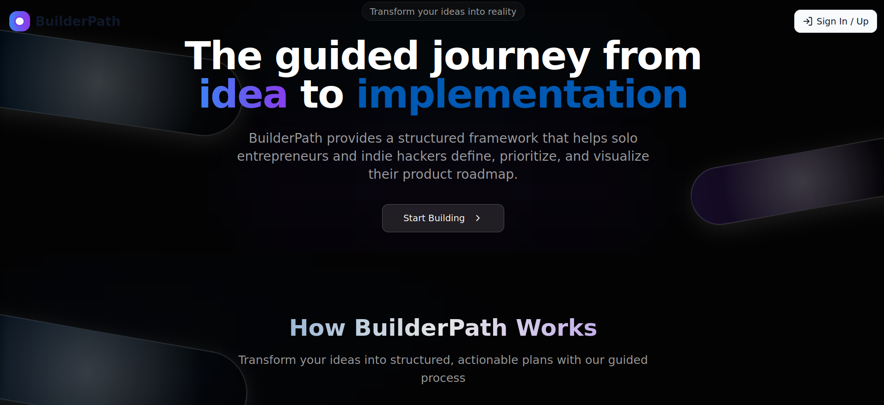

# Alexander Gurevich - Products Portfolio

  

***A product-focused technical leader specializing in AI/ML solutions with over 20 years of 
 software engineering expertise with hands-on experience with LangGraph, RAG, and 
 LangChain implementations. Passionate about bridging the gap between 
 technical capabilities and business value, with proven track record of implementing 
 production-ready  systems and leading global teams to transform complex business 
 challenges into high-impact software solutions. Currently focused on developing and 
 deploying generative AI and machine learning applications to enhance business performance 
 through innovative technical solutions.***

***More details on my [Linkedin Profile](https://www.linkedin.com/in/alexandergurevich/)***

---

## Products

###  [BuilderPath]()

**Guiding Indie Builders From Idea to Implementation**

Streamlining process from ideation to implementation .

<!-- **Key Impact:**  -->

[View Details →]()