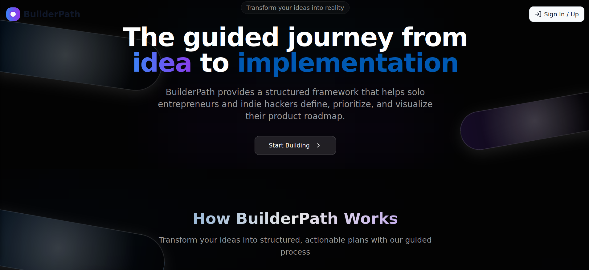
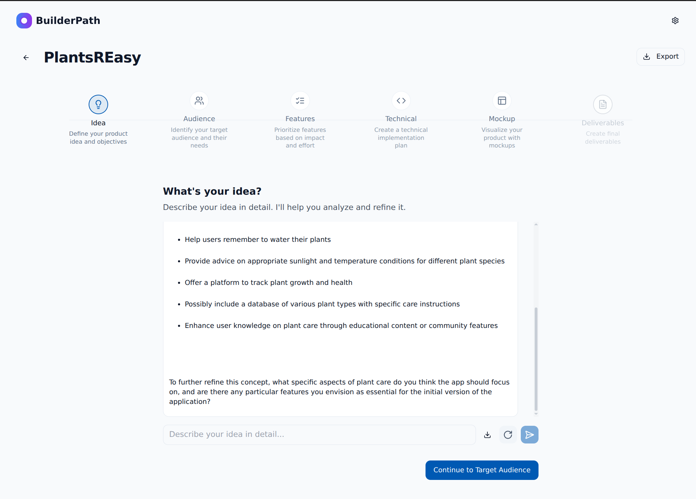
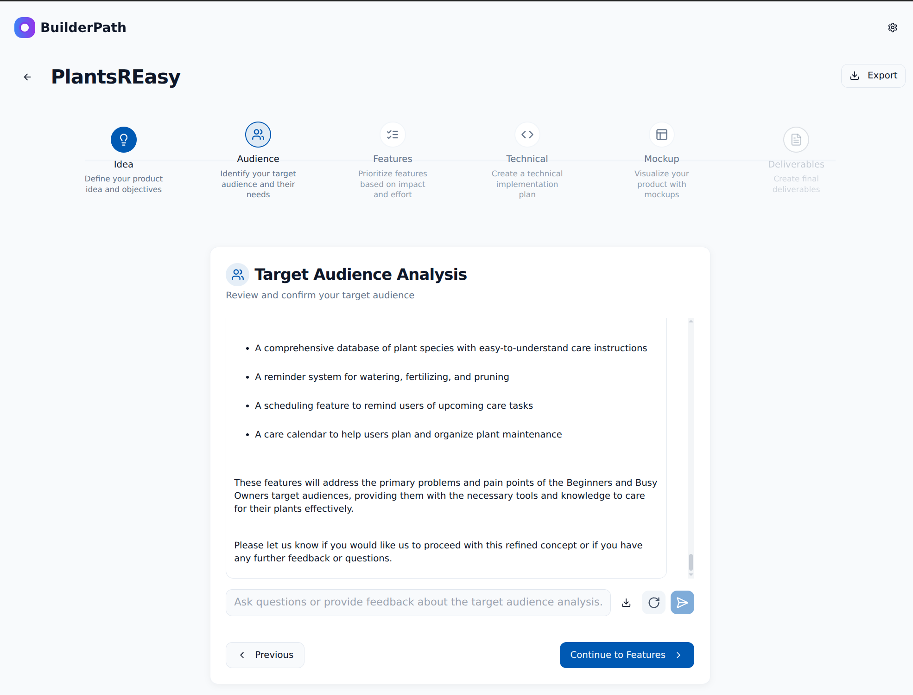
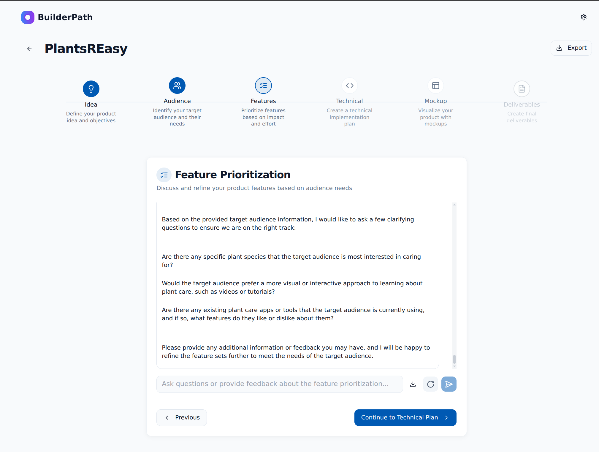
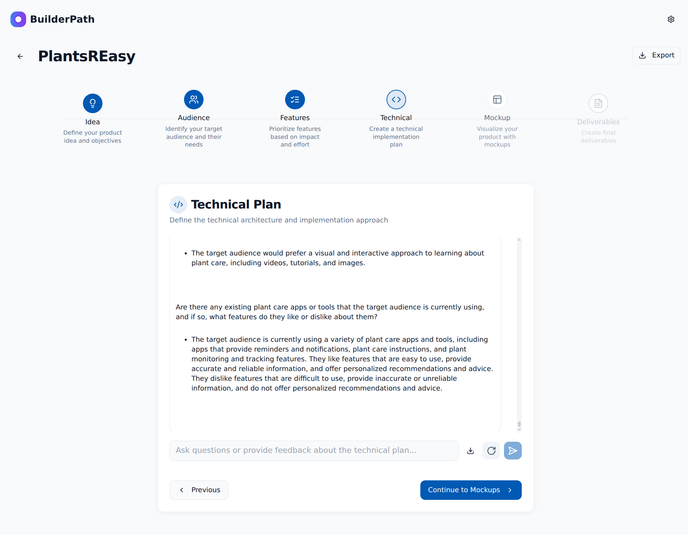
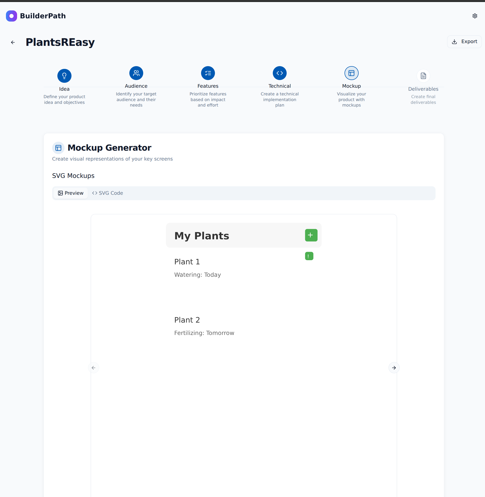
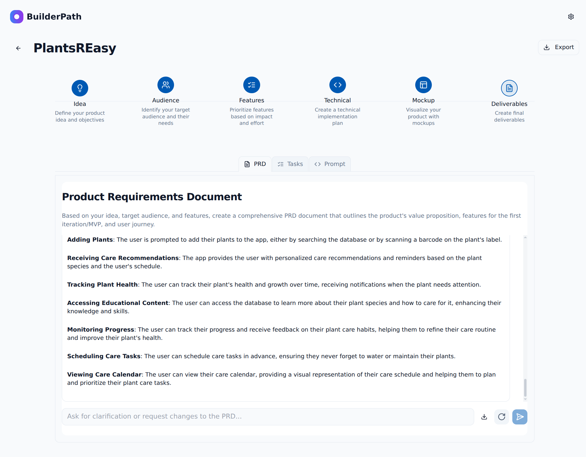

[← Back to Portfolio](../README.md)

# BuilderPath 
---
🌐 [Try it](https://idea-garden-path.lovable.app/)

**Streamlining process from Ideation to Implementation for Indie Builders**

---

## The Challenge

**Most indie builders struggle with focus and direction, having only idea without a clear path what should be done next**

Indie builders face critical bottlenecks:
- **Unclear target audience:** Building products without knowing who they're serving
- **What Features to focus on:** Trying to build everything instead of focusing on core value
- **Implementation paralysis:** Having ideas but lacking structured approach to turn them into 
reality

---

## The Solution

BuilderPath transforms product ideation from scattered brainstorming into a structured, AI-guided workflow that takes indie builders from initial concept to implementation-ready deliverables in a single place.

### Key Features

**💡 AI-Powered Ideation Assistant**
- Interactive brainstorming with contextual AI suggestions
- Idea refinement through guided questioning
- Concept validation and objective clarification
- Smart prompts to help users articulate their vision clearly

**🎯 Target Audience Analysis**
- Intelligent audience profiling with AI-generated insights
- Problem and pain point identification
- Automated value proposition generation based on audience needs

**📝 Dynamic Feature Prioritization**
- Impact vs. effort assessment matrix
- AI-powered feature recommendations
- Real-time priority adjustments based on target audience feedback

**🔧 Technical Implementation Planning**
- Auto-generated technical architecture plans
- Framework and technology recommendations
- Database design and integration strategies

**📱 Contextual Mockup Generation**
- AI-powered screen layouts based on prioritized features
- Responsive design templates for different app types
- Visual representations that evolve with feature changes

**📋 Implementation-Ready Deliverables**
- Comprehensive Product Requirements Documents (PRD)
- Structured task breakdowns for development
- AI coding assistant prompts tailored to your technical plan

---

## My Role & Responsibilities
**Product partner & Technical Lead** | *3-month development cycle*

**Product Strategy & Development**
- Co-designed product vision and user workflow with product manager
- Led technical architecture decisions and implementation
- Conducted user testing with custom AI prompts using Claude and ChatGPT
- Defined feature prioritization framework and AI integration strategy

**Technical Leadership**
- Built full-stack application using React 19 and Supabase
- Integrated multiple AI models (Gemini 2.5, Llama 3.3 70B) via Groq and Gemini APIs
- Implemented complex state management for multi-step workflow
- Designed real-time data synchronization between local storage and database

---

## Execution

### Phase 1: Workflow Design & Validation (Month 1)
**Research & Framework Development**
- Collaborated with product manager to map the complete indie builder journey
- Identified 6 core stages: Idea → Audience → Features → Technical → Mockups → Deliverables
- Created custom AI prompts for each stage and tested with 7 potential users
- Validated workflow effectiveness using Claude and ChatGPT prototypes

**Key Decisions:**
- **Sequential vs flexible navigation:** Chose guided sequential flow with ability to revisit and update earlier stages
- **AI integration depth:** Decided on contextual AI assistance rather than full automation

### Phase 2: MVP Development (Month 2)
**Technical Implementation**
- Built React 19 application with modern hooks and context patterns
- Implemented Supabase backend with Edge Functions for AI processing
- Created dynamic prompt engineering system that adapts based on user inputs
- Developed local storage fallback system for offline functionality

**Architecture Highlights:**
- **Multi-stage state management:** Complex state synchronization across 6 workflow stages
- **AI orchestration:** Intelligent prompt chaining that uses previous stage outputs as context
- **Real-time updates:** Dynamic regeneration of subsequent stages when earlier decisions change

### Phase 3: Polish & Launch (Month 3)
**User Experience Optimization**
- Refined multi-step navigation with clear progress indicators
- Implemented auto-save functionality and project management
- Added export capabilities for PRDs, tasks, and technical specifications
- Conducted soft launch with target indie builder communities

**Technical Achievements:**
- Successfully integrated 2 different AI models
- Built responsive design system that works across all device types
- Implemented efficient caching and state persistence
---

## Challenges & Achievements

### Challenges

**AI Prompt Engineering Complexity**
Multiple iterations were required to create prompts that generated consistently useful outputs across different user contexts. Each stage needed to understand and build upon previous outputs while maintaining coherence.

**First React Project Learning Curve**
As my first React 19 project, I had to rapidly learn modern React patterns, hooks, and state management while building a complex multi-stage application with intricate data flow requirements.

**Multi-Step UX Design**
Creating an intuitive workflow that guides users through 6 distinct stages while allowing flexibility to revisit and modify earlier decisions remains an ongoing UX challenge that impacts user completion rates.

**Market Validation Gap**
Despite initial positive user feedback during testing, the soft launch failed to gain traction, revealing a disconnect between user interest in testing and actual adoption of the complete workflow.

### Achievements

**Technical Innovation**
- Successfully built complex AI orchestration system with contextual prompt chaining
- Implemented sophisticated state management handling inter-dependent workflow stages
- Created seamless integration between multiple AI models

**Product Differentiation**
- **Target Audience Focus:** Unlike generic planning tools, BuilderPath enforces audience-first thinking
- **Context-Aware Features:** Feature recommendations adapt based on audience analysis and technical constraints  
- **Auto-Generated Mockups:** Dynamic visual representations that update as features and audience evolve
- **Implementation Bridge:** Unique focus on generating actual development artifacts, not just planning documents

**User Experience Success**
- Created end-to-end workflow that takes users from vague ideas to implementation-ready deliverables
- Enabled users to intervene and modify AI suggestions at every stage
- Built system that maintains context and coherence across all workflow stages

---

## Results & Impact

### Product Metrics
- **Live MVP** deployed at [idea-garden-path.lovable.app](https://idea-garden-path.lovable.app/)
- **3-month development cycle** from concept to launch
- **6-stage workflow** covering complete product development process
- **Multi-AI integration** with Gemini 2.5 and Llama 3.3 70B models

### Technical Accomplishments
- **Complex State Management:** Successfully handled interdependent data flow across 6 workflow stages
- **AI Integration:** Built robust prompt engineering system with contextual awareness
- **Full-Stack Development:** Delivered complete React/Supabase application with real-time features
- **Responsive Design:** Created seamless experience across desktop and mobile devices

### User Feedback
*Initially was interest but soft launch through community of indie builders did not attract users.*
<!-- *"The target audience focus was a game-changer - I actually understood who I was building for before jumping into features."* - Beta User

*"Having the technical plan automatically generated saved me weeks of architecture planning."* - Indie Developer -->

---

## Key Learnings

**AI Integration Requires Iteration:** Effective prompt engineering demands extensive testing with real user scenarios. Generic prompts fail; context-specific, stage-aware prompts succeed.

**User Flow Complexity vs. Adoption:** While comprehensive workflows provide value, they can create barriers to initial engagement. Balancing completeness with simplicity remains critical for user adoption.

**Technical Implementation as Differentiator:** Moving beyond planning tools to generate actual implementation artifacts (PRDs, tasks, code prompts) creates significantly more user value.

**React Learning in Production:** Building a complex application as a first React project accelerated learning but required careful attention to performance and state management patterns.

---
## Technical Stack & Architecture

- **Frontend:** React 19 with modern hooks and context patterns
- **Backend:** Supabase with Edge Functions for serverless AI processing
- **AI Integration:** Gemini 2.5 via Gemini API and Llama 3.3 70B via Groq API 
- **State Management:** Custom context providers with local storage persistence
- **Deployment:** Lovable platform for rapid iteration and deployment

[← Back to Portfolio](../README.md)

---

🌐 [Try it](https://idea-garden-path.lovable.app/) | 📧 [Contact Me](mailto:topexpertsolutions@gmail.com)